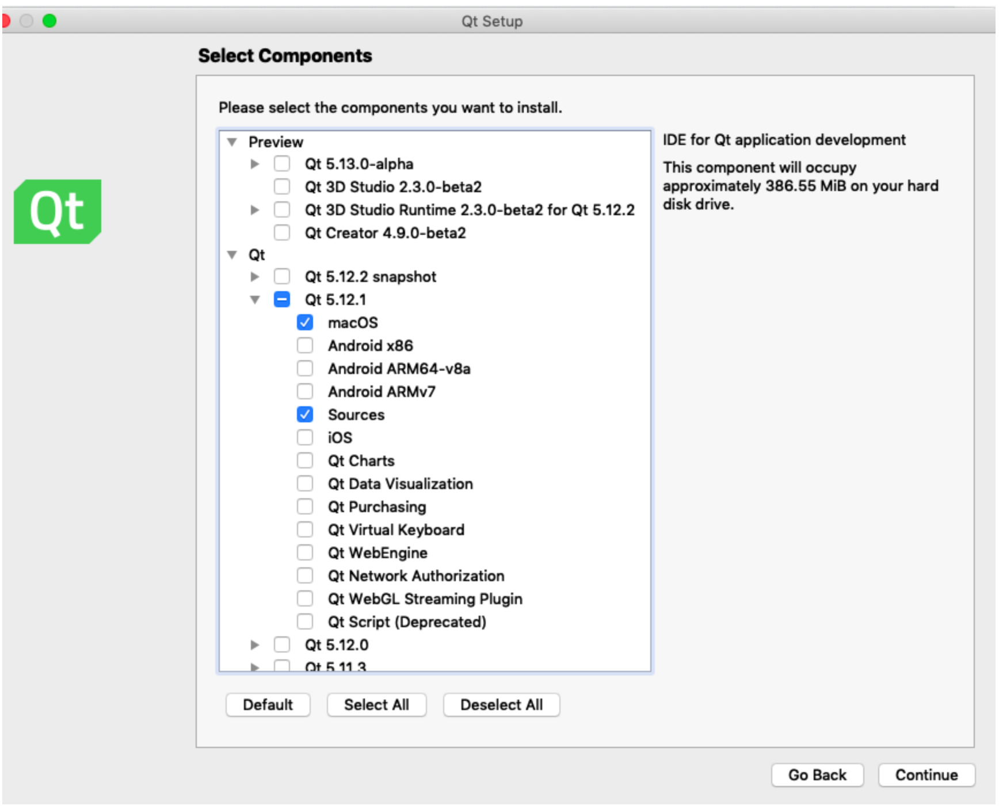
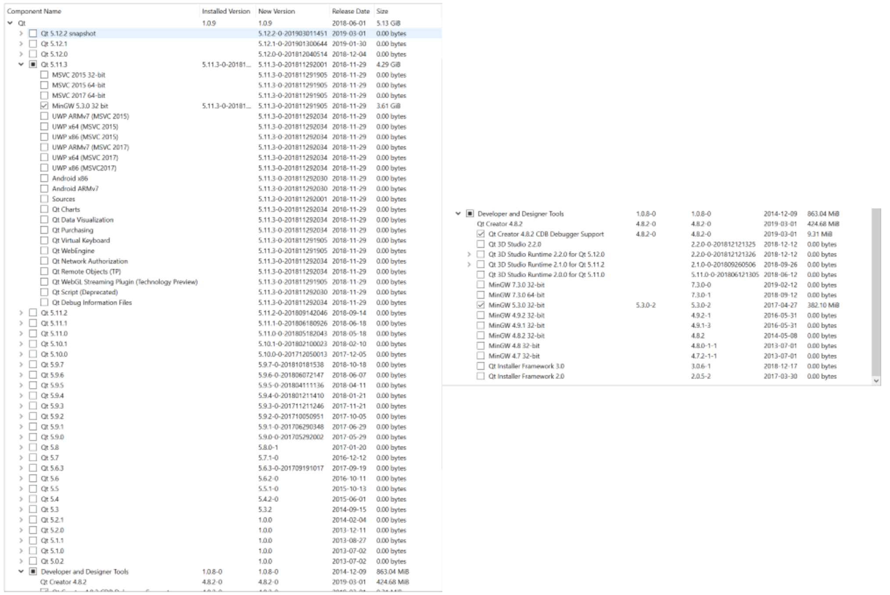

PE 8 (Qt installation + tutorial)
==============

1. (5 points) Install [QtCreator](http://doc.qt.io/qt-5/gettingstarted.html). We'll be using Qt version 5.x. Warning: this software can take a significant amount of space on your machine. If you follow our installation guidelines, it won't be quite so big. You can uninstall it at the end of the semester, but we will be using it for the rest of the course.
- Here is a [Qt for beginners wiki that you may find useful](https://wiki.qt.io/Qt_for_Beginners)
- Please post any Qt Installation questions on piazza with screenshots so that your classmates, the CAs, the TAs, and I can help you out (or come to office hours).
- You should download the open source version. When you get to the install screen select "Qt Creator" only the most recent version of Qt. (Not All! That would be _very_ _very_ large.)
    - here is a further image of options that you can select to make the installation smaller: 
- Note that if you are running QtCreator on certain linux distributions, the resolution settings are not ideal. If you find the settings to fix these, please post them on piazza.
- Felix has the binaries downloaded and on a flash drive. Come to office hours if downloading them is taking you a very long time.
Windows
------
- some students encountered difficulties installing QtCreator where they get an error similar to "Error while building/deploying project PROJECT NAME .... The kit Desktop Qt 5.12.1 MinGW 64-bit has configuration issues which might be the root cause for this problem".
    - The solution for this problem was to only select the following elements when installing: 

Mac OSx
------
- you can install via the install link above, or [via homebrew](http://macappstore.org/qt-creator/)

Linux
-----
- here is one [ubuntu installation tutorial](https://www.ics.com/blog/getting-started-qt-and-qt-creator-linux)

__Make sure to get started on this early. You should be able to get through Part 2, step 5 by class on Tuesday/Wednesday so we can help with any issues that arise.__  If you encounter issues, post a message on piazza and include your operating system and the text of the errors that you are receiving.

Part 2: Starting a project in Qt Creator (15 points)
-------------------------
1. Click "New Project", then choose "Qt Widgets Application".
2. Give this project a name.
3. Choose the Desktop Qt for Kit selection (no need to choose any mobile kits as well).
4. Click "Continue" under the Class Information tab, then click "Done" under the Project Management tab.
5. Under the "Edit" choice (on the left-hand options tab), click your new project folder. Either right-click the folder, then choose "run" OR click the green play button on the bottom left of the screen.
    1. You should have a blank window titled "MainWindow" pop-up. To exit, press the "x" button in the upper right-hand corner of your running application.
6. Edit `mainwindow.cpp` by adding `ui->statusBar->showMessage("YOUR MESSAGE HERE")` to the `MainWindow` constructor. Run the application and take a screenshot. Make sure to replace the string "YOUR MESSAGE HERE" with a message of your own!
7. Add a push button to your UI. Do this by clicking on the "Forms" folder, then "mainwindow.ui". This will open a WYSIWYG (What You See Is What You Get) editor for your GUI. You can search for elements in the text box in the upper left hand side of this editor.
8. Right-click the push button from the step before, select "Go To Slot", then choose "clicked()" under "QAbstractButton". Modify the function that is provided so that each time you click your new button, the text in the status bar changes. The status bar should show the number of times that the button has been clicked. Hint: you may find adding a field to MainWindow to be useful for this. 

__To turn in__:
- 1 screenshot of your installed version of Qt Creator running your application from part 2
- mainwindow.h
- mainwindow.cpp

Part 3: Signals and slots in Qt (5 points)
------------------
Complete the PE 8 Part 3 quiz on Canvas. [Read the Qt documentation about signals and slots](http://doc.qt.io/qt-5/signalsandslots.html) before answering the questions.

